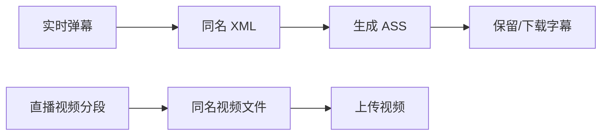

# 弹幕与 ASS

PotatoFlow 在录制视频的同时保存 XML 弹幕。每个视频分段完成后，会把对应 XML 转换为 ASS 字幕文件。

## 为什么不默认烧录

烧录需要重新编码整段视频，消耗大量 CPU、时间和磁盘临时空间。PotatoFlow 默认上传原画视频，并把 ASS 作为独立产物保存，避免不必要的转码。

## 如何检查

在“上传任务”点击处理进度，打开 **生成 ASS** 步骤，可以查看：

- XML 路径
- ASS 路径
- 识别到的弹幕数量
- 是否启用烧录
- 原始执行日志

!!! tip
    视频、XML 和 ASS 使用同一分段时间关系。下载 ASS 后，可在支持外挂字幕的播放器中直接加载。

