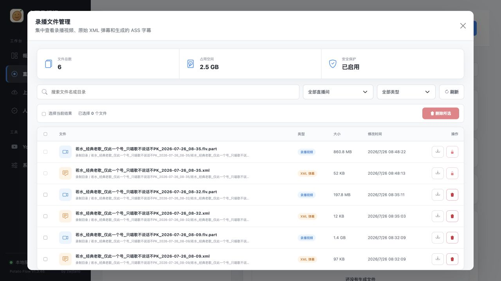

# 文件管理

“直播录制 → 文件管理”集中展示录播视频、XML 弹幕和 ASS 字幕。

  
  
可按直播间和文件类型筛选，查看空间占用，下载文件或多选删除。

## 可用操作

- 按文件名或目录搜索
- 按直播间、文件类型筛选
- 单个下载
- 单个删除
- 多选删除
- 查看文件数量与磁盘占用

正在写入的 `.part` 文件会受到安全保护，不能被误删。安全收尾后才会成为可处理的完整视频。

## 上传后自动删除

开启 `delete_recording_after_upload` 后，B站投稿确认成功才删除对应源录播。失败、审核中或尚未投稿的文件会保留。

