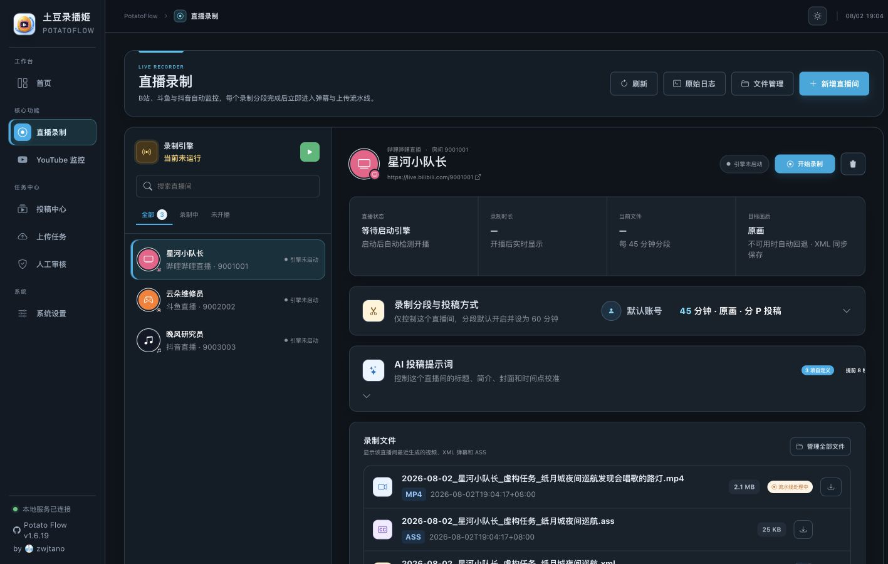

# 使用指南

这里解释日常使用 PotatoFlow 的完整流程。每篇指南围绕一个可完成的任务展开，并标明它在录制、处理或投稿链路中的位置。

<figure class="local-ui-shot">
  
  <figcaption>以下指南均配用当前本地 5001 的功能截图；页面中的人物、房间号、文件名和任务内容全部为虚构。</figcaption>
</figure>

  <a class="docs-card" href="live-recording/"><strong>直播录制</strong>添加直播间、理解检测状态，并安全开始或停止录制。</a>
  <a class="docs-card" href="segmentation/"><strong>分段与分P</strong>控制单段时长，以及独立投稿或合并分P的方式。</a>
  <a class="docs-card" href="danmaku-ass/"><strong>弹幕与 ASS</strong>保存 XML、生成 ASS，并按直播间控制是否烧录。</a>
  <a class="docs-card" href="ai-publishing/"><strong>AI 投稿</strong>生成标题、摘要、标签、分区和封面，并保留人工兜底。</a>
  <a class="docs-card" href="tasks-review/"><strong>任务与人工审核</strong>查看任务步骤、错误证据、重试和人工修改入口。</a>
  <a class="docs-card" href="file-management/"><strong>文件管理</strong>检查录播、字幕、封面与磁盘占用，避免误删源文件。</a>

## 平台边界

哔哩哔哩、斗鱼和抖音可用于直播检测与录制；当前自动投稿目标为哔哩哔哩。具体平台差异请在对应指南中核对。
