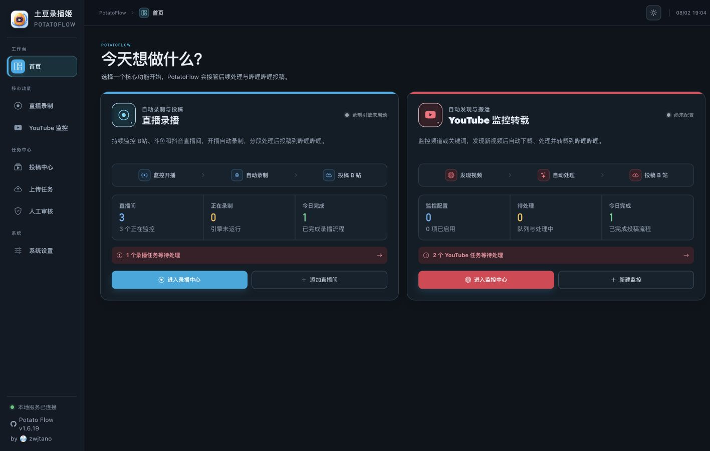

---
hide:
  - navigation
  - toc
---

  <section class="home-intro">
    

      PotatoFlow 中文文档
      <h1>从直播录制到投稿，跑通一条可维护的流水线</h1>
      
从部署、录制、弹幕处理到 AI 稿件与 B站投稿，按照真实任务找到下一步。适用于长期运行的 Linux 与 Docker 环境。

      

        <a class="pf-button pf-button-primary" href="getting-started/">开始部署</a>
        <a class="pf-button pf-button-secondary" href="guides/">浏览使用指南</a>
      

    

    <aside class="first-run-card" aria-label="首次上线步骤">
      

        首次上线
        <strong>约 15 分钟</strong>
      

      <ol>
        <li>01
<strong>启动服务</strong><small>使用 Docker 完成安装与健康检查</small>
</li>
        <li>02
<strong>连接账号</strong><small>校验 B站登录态并配置 AI 服务</small>
</li>
        <li>03
<strong>添加直播间</strong><small>确认录制范围、分段和投稿方式</small>
</li>
      </ol>
      <a href="getting-started/first-run/">查看首次配置清单 →</a>
    </aside>
  </section>

  <figure class="local-ui-shot">
    
    <figcaption>本地 5001 当前工作台。星河小队长、云朵维修员、晚风研究员及页面中的房间号、任务均为虚构演示数据。</figcaption>
  </figure>

  <section class="home-section">
    

      
按目标查找<h2>现在要完成什么？</h2>

      
文档按任务组织，不要求先理解所有功能。

    

    

      <a class="path-card" href="getting-started/">
        01 · START
        <h3>首次部署</h3>
        
准备服务器、启动容器、完成首次配置，并确认服务可以持续运行。

        <strong>进入快速开始 →</strong>
      </a>
      <a class="path-card" href="guides/">
        02 · USE
        <h3>建立录播流程</h3>
        
配置直播间、分段、弹幕、AI 稿件、人工审核和最终投稿。

        <strong>进入使用指南 →</strong>
      </a>
      <a class="path-card" href="operations/">
        03 · OPERATE
        <h3>维护生产服务</h3>
        
围绕检查、更新、备份和恢复组织，不把日常运维混进字段参考。

        <strong>进入部署运维 →</strong>
      </a>
      <a class="path-card" href="troubleshooting/">
        04 · FIX
        <h3>处理异常</h3>
        
从可见症状开始定位容器、页面、登录、AI、录制与投稿问题。

        <strong>进入故障排查 →</strong>
      </a>
    

  </section>

  <section class="home-section workflow-section">
    

      
完整链路<h2>一条可以逐步检查的工作流</h2>

      <a class="section-link" href="guides/tasks-review/">查看任务与人工审核 →</a>
    

    

      
01<strong>检测开播</strong><small>直播间状态</small>

      
02<strong>录制与弹幕</strong><small>视频 · XML</small>

      
03<strong>处理内容</strong><small>ASS · AI 稿件</small>

      
04<strong>审核投稿</strong><small>封面 · B站</small>

    

  </section>

  <section class="help-band">
    
需要答案<h2>从症状查问题，或直接核对字段。</h2>

    

      <a href="troubleshooting/">常见问题与排障</a>
      <a href="reference/">配置与存储参考</a>
    

  </section>

