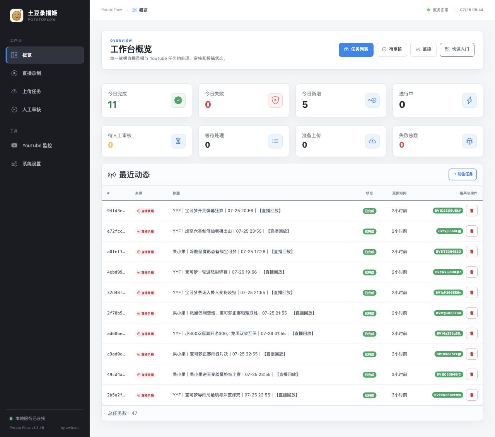
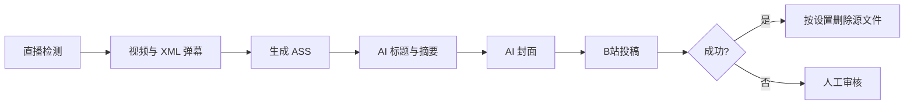

---
hide:
  - navigation
---

  

    <h1>PotatoFlow</h1>
    
把直播检测、原画录制、XML 弹幕、ASS 字幕、AI 稿件与 B站投稿放进一个 Linux 服务、一个 WebUI、一个端口。

    

      <a href="getting-started/docker/">Docker 安装</a>
      <a class="secondary" href="guides/live-recording/">查看录播流程</a>
    

  

  

  
<strong>三平台录制</strong>哔哩哔哩、斗鱼、抖音直播检测、原画录制与弹幕采集。

  
<strong>AI 稿件</strong>依据本段弹幕生成标题、摘要、标签、分区与 GPT Image 封面。

  
<strong>B站投稿</strong>逐段独立投稿或合并分P，失败进入人工审核，完成后可自动清理源文件。

  
  
真实本地服务的概览页：录制、处理、存储和任务状态集中展示。

## 一条可检查的录播流水线

每一步都有状态、开始/完成时间、产物和原始日志。任务页不会在你查看详情时强制刷新。

## 设计边界

- 对外只监听 `5001`，录制 worker 在同一个容器中运行。
- 投稿平台只保留哔哩哔哩；YouTube 功能保留用于下载与监控。
- 弹幕保存为 XML 并生成独立 ASS，默认不烧录进视频。
- 每个直播间独立设置分段时长、是否合并分P、是否仅录制。
- 抖音沿用 biliup 原生解析方式；不内置 Chromium，不提供扫码登录。

!!! tip "从这里开始"
    新服务器优先使用 [Docker 安装](getting-started/docker.md)，然后按 [首次配置](getting-started/first-run.md) 完成 B站登录和 AI 设置。

