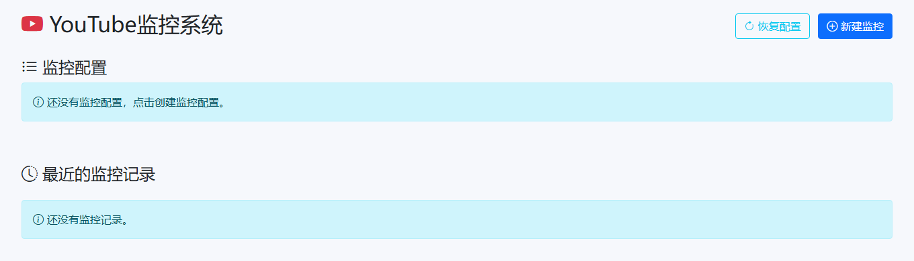
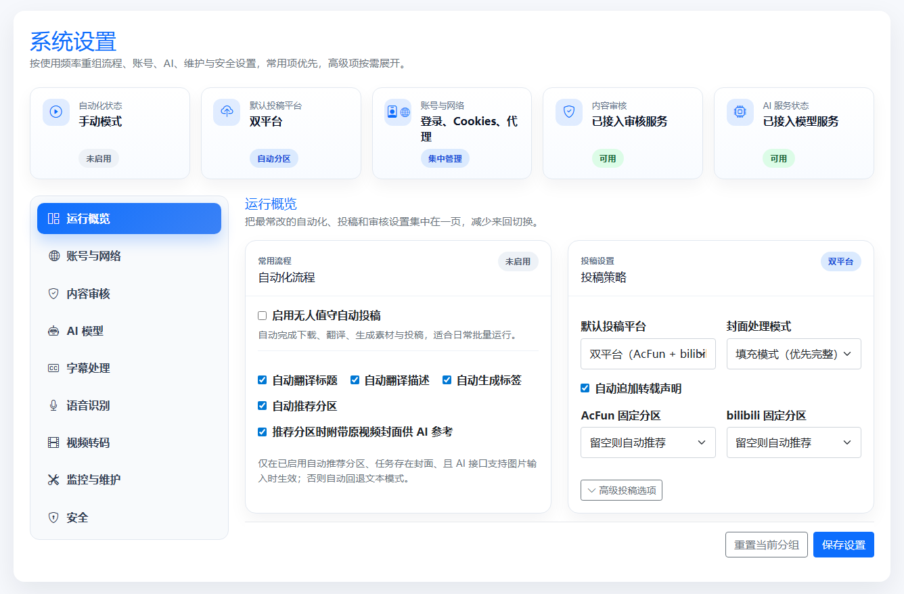

<div align="center">

# Y2A-Auto


将 YouTube 视频自动搬运到 AcFun / bilibili 的一体化工具。

[](LICENSE)
[](https://www.python.org/)
[](https://www.docker.com/)

从下载、ASR、字幕翻译、字幕质检、内容审核到上传，全流程自动化；内置 Web 管理后台、YouTube 监控和维护能力。

[快速开始](#快速开始) · [功能概览](#功能概览) · [部署与运行](#部署与运行) · [配置说明](#配置说明) · [使用指南](#使用指南) · [通知推送](#通知推送) · [CookieCloud](#cookiecloud-集成) · [安全特性](#安全特性) · [常见问题](#常见问题)

---

</div>

<p align="center">
  <a href="https://t.me/Y2AAuto_bot" target="_blank">
    
  </a>
  <br/>
  <strong>Telegram 转发机器人（试用）：</strong>
  <a href="https://t.me/Y2AAuto_bot">@Y2AAuto_bot</a>
  <br/>
  <sub>自部署版本：<a href="https://github.com/fqscfqj/Y2A-Auto-tgbot">Y2A-Auto-tgbot</a></sub>
</p>

## 项目展示

<p align="center">
  
</p>

<p align="center">
  
  
</p>

<div align="center">
  <sub>以上为当前页面截图。</sub>
</div>

## 核心亮点

| 能力模块 | 说明 |
| --- | --- |
| 全流程自动化 | 从下载、ASR、字幕、元信息到上传一条龙处理 |
| 审核可控 | 支持人工审核、强制上传、内容安全检测和登录保护 |
| 灵活部署 | Docker / 本地双模式，支持 CPU 与多种 GPU 编码 |
| 监控拉取 | 支持 YouTube 频道 / 关键词定时抓取与历史记录 |
| 消息推送 | 企业微信、Server酱、message-pusher 多渠道异步通知 |
| CookieCloud | 从 CookieCloud 服务自动同步 YouTube Cookies |
| 安全防护 | 密码保护、暴力破解锁定、会话超时、路径遍历防护 |
| 维护完善 | 支持日志清理、下载清理、并发控制和 FFmpeg 自动补齐 |

## 功能概览

- 自动化流水线
  - `yt-dlp` 下载视频与封面
  - 自动或按需进行语音识别生成字幕，支持 Whisper、Voxtral
  - 字幕翻译、字幕后处理、字幕质检（QC）与字幕烧录
  - AI 生成标题、简介、标签与分区推荐
  - 内容安全审核（阿里云 Green）
  - 自动上传到 AcFun / bilibili / 双平台
- Web 管理后台
  - 任务列表、人工审核、强制上传
  - 设置中心分组管理：运行概览、账号与网络、内容审核、AI 模型、字幕处理、语音识别、视频转码、监控与维护、安全
  - 登录保护、错误次数锁定和密码管理
- YouTube 监控
  - 频道监控与关键词搜索监控
  - 支持 latest / historical 模式、视频类型筛选和自动加入任务队列
  - 内置历史记录与配置文件恢复
- 通知推送
  - 企业微信、Server酱、message-pusher 三种渠道
  - 任务添加 / 完成 / 失败、登录成功 / 锁定、QR 登录成功 / 失败等事件推送
  - 异步重试队列，递增间隔保证投递
- CookieCloud 集成
  - 从 CookieCloud 服务自动拉取 YouTube / Google Cookies
  - 支持 auto / legacy / aes-128-cbc-fixed 加密模式
  - Web UI 一键测试与同步
- 字幕变换引擎
  - 长行自动拆分、标点标准化、填充词 / 重复词过滤
  - 幻觉文本与噪声标签检测、文本密度过高检测
  - 时间偏移、最短时长、相邻间隙合并等后处理
- 视频转码
  - 支持 CPU / NVIDIA / Intel / AMD 硬件编码
  - 默认优先 HEVC / H.265，失败后自动回退到 H.264
- 平台认证
  - AcFun / bilibili 支持 QR 码扫码登录
  - bilibili 支持 Cookie 导入（Netscape / JSON 格式）
- 维护与环境
  - Windows 可自动补齐 FFmpeg
  - 支持日志清理、下载清理和自定义 FFmpeg 路径

## 项目结构

```text
Y2A-Auto/
├── app.py
├── requirements.txt
├── Dockerfile
├── docker-compose.yml
├── docker-compose-build.yml
├── acfunid/
├── build-tools/
├── config/
├── cookies/
├── db/
├── downloads/
├── ffmpeg/
├── fonts/
├── logs/
├── modules/
├── static/
├── temp/
├── templates/
└── tests/
```

## 快速开始

推荐使用 Docker（无需手动安装 Python、FFmpeg、yt-dlp）。

1. 准备 Cookie（必须）
- `cookies/yt_cookies.txt`：YouTube 登录 Cookie
- `cookies/ac_cookies.json`：AcFun 登录 Cookie
- `cookies/bili_cookies.json`：bilibili 登录 Cookie
- 可使用浏览器扩展导出 `cookies.txt`，请勿提交到仓库

2. 启动服务

```bash
# 默认从 Docker Hub 拉取镜像 fqscfqj/y2a-auto:latest
# 如需使用 GitHub 容器注册表，可切换为 ghcr.io/fqscfqj/y2a-auto:latest
docker compose up -d
```

3. 打开 Web
- 访问 `http://localhost:5000`
- 首次进入建议先配置登录保护、平台账号和 YouTube Cookie

默认会持久化目录：`config/`、`db/`、`downloads/`、`logs/`、`temp/`、`cookies/`。

说明：`fonts/` 中的字体属于项目内置依赖，用于字幕烧录；许可证见 `fonts/LICENSE.txt`。

## 部署与运行

### 方案 A：Docker（推荐）

- 启动：`docker compose up -d`
- 停止：`docker compose down`
- 重启：`docker compose restart`
- 日志：`docker compose logs -f`

如需本地构建镜像，可使用：

```bash
docker compose -f docker-compose-build.yml up -d --build
```

### 方案 B：本地运行

前置要求：
- Python 3.11+
- FFmpeg
- yt-dlp

```powershell
py -3.11 -m venv .venv
.\.venv\Scripts\Activate.ps1
pip install -r requirements.txt
python app.py
```

访问 `http://127.0.0.1:5000`。

### 方案 C：Windows 便携包

- `build-tools/` 提供 Windows 可执行文件构建工具
- 官方 Windows Release 包通常已内置 FFmpeg / FFprobe
- 如果手工打包，保持 `ffmpeg/` 目录完整即可

## 配置说明

首次运行会自动生成 `config/config.json`。推荐先配置以下几类参数：

### 基础与安全

- `AUTO_MODE_ENABLED`：无人值守自动投稿总开关，默认 `false`
- `password_protection_enabled`：Web 密码保护，默认 `false`
- `LOGIN_MAX_FAILED_ATTEMPTS`：连续错误次数上限，默认 `5`
- `LOGIN_LOCKOUT_MINUTES`：锁定时长，默认 `15`
- `LOGIN_SESSION_TIMEOUT_MINUTES`：登录空闲超时时长，默认 `30` 分钟，最小 `1`，访问受保护页面会自动续期
- `UPLOAD_TARGET_DEFAULT`：默认投稿平台，支持 `acfun`、`bilibili`、`both`
- `UPLOAD_APPEND_REPOST_NOTICE`：是否自动追加转载声明，默认 `true`

### 账号与网络

- `YOUTUBE_COOKIES_PATH`：YouTube Cookie 路径
- `ACFUN_COOKIES_PATH`：AcFun Cookie 路径
- `BILIBILI_COOKIES_PATH`：bilibili Cookie 路径
- `YOUTUBE_PROXY_ENABLED` / `YOUTUBE_PROXY_URL`：YouTube 下载代理
- `YOUTUBE_API_PROXY_ENABLED` / `YOUTUBE_API_PROXY_URL`：YouTube 监控 API 独立代理，不继承下载代理
- `YOUTUBE_DOWNLOAD_THREADS`：下载线程数
- `YOUTUBE_THROTTLED_RATE`：下载速度限制
- `YOUTUBE_API_KEY`：YouTube Data API v3 密钥，监控功能需要
- `FFMPEG_LOCATION`：自定义 FFmpeg 路径
- `FFMPEG_AUTO_DOWNLOAD`：Windows 缺失时自动下载 FFmpeg，默认 `true`

### AI 与投稿

- `OPENAI_API_KEY` / `OPENAI_BASE_URL` / `OPENAI_MODEL_NAME`：全局 AI 配置
- `OPENAI_THINKING_ENABLED`：全局思考模式开关
- `SUBTITLE_OPENAI_*`：字幕翻译专用覆盖配置，留空则回退全局
- `SUBTITLE_QC_*`：字幕质检专用覆盖配置，留空则回退字幕翻译 / 全局配置
- `TRANSLATE_TITLE` / `TRANSLATE_DESCRIPTION` / `GENERATE_TAGS`：自动生成标题、简介、标签
- `RECOMMEND_PARTITION`：自动推荐分区
- `FIXED_PARTITION_ID` / `FIXED_PARTITION_ID_BILIBILI`：固定分区
- `YOUTUBE_UPLOADER_AS_FIRST_TAG`：将上传者作为首标签

### 字幕处理

- `SUBTITLE_TRANSLATION_ENABLED`：启用字幕翻译，默认 `false`
- `YOUTUBE_AUTO_GENERATED_SUBTITLES_ENABLED`：下载 YouTube 自动生成字幕，默认 `false`
- `SUBTITLE_SOURCE_LANGUAGE`：源语言，默认 `auto`
- `SUBTITLE_TARGET_LANGUAGE`：目标语言，默认 `zh`
- `SUBTITLE_FONT_NAME`：烧录字幕字体名，默认 `SourceHanSansHWSC-VF.otf`
- `SUBTITLE_BATCH_SIZE`：翻译批次大小
- `SUBTITLE_MAX_RETRIES` / `SUBTITLE_RETRY_DELAY`：翻译重试策略
- `SUBTITLE_EMBED_IN_VIDEO`：是否将字幕嵌入视频
- `SUBTITLE_KEEP_ORIGINAL`：是否保留原始字幕文件
- `SUBTITLE_MAX_WORKERS`：字幕翻译并发线程数

### 语音识别（ASR）

- `SPEECH_RECOGNITION_ENABLED`：是否启用语音识别生成字幕，默认 `false`
- `SPEECH_RECOGNITION_PROVIDER`：支持 `whisper`、`voxtral`
- `VAD_ENABLED`：VAD 语音扫描窗，默认 `true`
- `WHISPER` 路径默认使用 `segment` 级时间戳，并自动兼容不支持 `timestamp_granularities` 的接口
- `WHISPER_LANGUAGE` / `WHISPER_PROMPT` / `WHISPER_TRANSLATE`：Whisper 专用参数
- `VOXTRAL_TIMESTAMP_GRANULARITIES`：默认 `segment,word`
- `VOXTRAL_DIARIZE` / `VOXTRAL_CONTEXT_BIAS` / `VOXTRAL_LANGUAGE`
- `VOXTRAL_MAX_AUDIO_DURATION_S` / `VOXTRAL_LONG_AUDIO_MARGIN_S` / `VOXTRAL_ENFORCE_MAX_DURATION`

### 视频转码与维护

- `VIDEO_ENCODER`：`auto` / `cpu` / `nvidia` / `intel` / `amd`
- `VIDEO_CUSTOM_PARAMS_ENABLED` / `VIDEO_CUSTOM_PARAMS`：自定义 FFmpeg 参数
- `MAX_CONCURRENT_TASKS`：最大并发任务数，默认 `2`
- `MAX_CONCURRENT_UPLOADS`：最大并发上传数，默认 `1`
- `LOG_CLEANUP_ENABLED` / `LOG_CLEANUP_HOURS` / `LOG_CLEANUP_INTERVAL`
- `DOWNLOAD_CLEANUP_ENABLED` / `DOWNLOAD_CLEANUP_HOURS` / `DOWNLOAD_CLEANUP_INTERVAL`

### 通知推送

- `NOTIFY_ENABLED`：启用消息推送，默认 `false`
- `NOTIFY_CHANNELS`：启用的渠道列表，支持 `wecom`、`serverchan`、`message_pusher`
- `NOTIFY_EVENTS`：订阅的事件列表，可选 `task_added`、`task_completed`、`task_failed`、`login_success`、`login_locked`、`qr_login_success`、`qr_login_failed`
- 企业微信：`NOTIFY_WECOM_WEBHOOK_URL`
- Server酱：`NOTIFY_SERVERCHAN_SENDKEY`
- message-pusher：`NOTIFY_MESSAGE_PUSHER_SERVER` / `NOTIFY_MESSAGE_PUSHER_USERNAME` / `NOTIFY_MESSAGE_PUSHER_TOKEN`

### CookieCloud

- `COOKIECLOUD_ENABLED`：启用 CookieCloud 同步，默认 `false`
- `COOKIECLOUD_SERVER_URL`：CookieCloud 服务地址
- `COOKIECLOUD_UUID`：CookieCloud UUID
- `COOKIECLOUD_PASSWORD`：CookieCloud 加密密码
- `COOKIECLOUD_ENCRYPT_MODE`：加密模式，支持 `auto` / `legacy` / `aes-128-cbc-fixed`

### 内容审核

- `CONTENT_MODERATION_ENABLED`：启用阿里云内容审核，默认 `false`
- `ALIYUN_ACCESS_KEY_ID` / `ALIYUN_ACCESS_KEY_SECRET`：阿里云 AK/SK
- `ALIYUN_CONTENT_MODERATION_REGION`：审核服务区域
- `ALIYUN_TEXT_MODERATION_SERVICE`：文本审核服务名，默认 `comment_detection_pro`

### 下载质量

- `YOUTUBE_DOWNLOAD_QUALITY_MODE`：下载质量模式
- `YOUTUBE_DOWNLOAD_MAX_HEIGHT`：最大分辨率高度限制

### 字幕后处理

- `SUBTITLE_MAX_LINE_LENGTH`：单行最大字符数，默认 `42`
- `SUBTITLE_MAX_LINES`：单条字幕最大行数，默认 `2`
- `SUBTITLE_NORMALIZE_PUNCTUATION`：标点标准化，默认 `true`
- `SUBTITLE_FILTER_FILLER_WORDS`：过滤填充词（um、uh 等），默认 `true`
- `SUBTITLE_TIME_OFFSET_S`：字幕时间偏移（秒）
- `SUBTITLE_MIN_CUE_DURATION_S`：最短字幕时长，默认 `0.6`
- `SUBTITLE_MERGE_GAP_S`：相邻间隙合并阈值，默认 `0.3`

### 配置示例

```json
{
  "AUTO_MODE_ENABLED": false,
  "password_protection_enabled": false,
  "password": "",
  "UPLOAD_TARGET_DEFAULT": "acfun",
  "OPENAI_API_KEY": "",
  "OPENAI_BASE_URL": "https://api.openai.com/v1",
  "OPENAI_MODEL_NAME": "gpt-3.5-turbo",
  "OPENAI_THINKING_ENABLED": false,
  "SUBTITLE_TRANSLATION_ENABLED": false,
  "SUBTITLE_QC_ENABLED": false,
  "SPEECH_RECOGNITION_ENABLED": false,
  "SPEECH_RECOGNITION_PROVIDER": "whisper",
  "VAD_ENABLED": true,
  "VIDEO_ENCODER": "auto",
  "FFMPEG_AUTO_DOWNLOAD": true,
  "MAX_CONCURRENT_TASKS": 2,
  "MAX_CONCURRENT_UPLOADS": 1
}
```

## 字幕质检说明

启用 `SUBTITLE_QC_ENABLED: true` 后，系统会对 ASR 生成的源字幕做预检：

- `SUBTITLE_QC_THRESHOLD`：AI 复核分数下限（0 ~ 1，默认 0.60）
- `SUBTITLE_QC_SAMPLE_MAX_ITEMS`：AI 抽样条目上限，默认 80
- `SUBTITLE_QC_MAX_CHARS`：AI 单次送检最大字符数上限，默认 9000
- `SUBTITLE_QC_MODEL_NAME`：单独指定 QC 模型，留空则复用字幕翻译 / 全局模型

QC 会先用规则做硬拦截，只有边界样本才会调用 AI 严格复核。

命中署名行、噪声提示、界面操作词、模板化重复句等明显低质量字幕时，会在规则层直接失败，不再进入宽松放行。

可疑样本在 AI 不可用、返回异常或输出不合规时，默认按失败处理。QC 失败时会跳过烧录字幕，但仍保留字幕文件并继续上传原视频，任务最终标记为完成，并显示字幕异常标记。

## 语音识别说明

当前支持两类 ASR 提供商：

- Whisper：兼容 OpenAI 风格接口，可使用独立的 API Key、Base URL 和模型名
- Voxtral：Mistral /v1/audio/transcriptions，默认模型为 `voxtral-mini-latest`

建议优先保持 `VAD_ENABLED=true`。当前默认采用质量优先的扫描窗参数，分片更短、重叠更小，便于提升字幕边界精度。

如果 VAD 结果不理想，系统会自动进入分片或整段兜底流程。

## 内置字幕字体

- 项目默认内置 `SourceHanSansHWSC-VF.otf`，作为字幕烧录依赖随仓库一起分发
- 可通过 `SUBTITLE_FONT_NAME` 指定 `fonts/` 目录中的字体文件名；程序会读取该文件的真实字体名供 libass 使用
- 字体许可证位于 `fonts/LICENSE.txt`

## 使用指南

1. 在首页或任务页提交 YouTube 链接创建任务。
2. 自动模式下流程为：下载 -> ASR / 字幕处理（可选） -> AI 元信息 -> 审核 -> 上传目标平台。
3. 在人工审核页可调整标题、简介、标签、分区并强制上传。
4. 启用 YouTube 监控后，可按频道或关键词定时拉取任务，并自动加入任务队列。
5. 在设置页可分组维护账号、AI、字幕、ASR、转码、维护与安全项。
6. AcFun / bilibili 支持 QR 码扫码登录：在设置页点击「扫码登录」，用手机 App 扫码即可完成认证。
7. 如已部署 CookieCloud 服务，可在设置页配置后一键同步 YouTube Cookies，无需手动导出。
8. 启用通知推送后，任务状态变化和登录事件会自动推送到企业微信等渠道。

## FFmpeg 与硬件加速

- 默认优先使用项目内 `ffmpeg/` 目录中的二进制
- Windows 环境下如果 `ffmpeg/` 缺失，系统可自动下载并补齐
- `FFMPEG_LOCATION` 可覆盖默认路径，支持直接指向 `ffmpeg.exe` 或其所在目录
- `VIDEO_ENCODER=cpu` 时使用 `libx264`（H.264）
- `VIDEO_ENCODER=auto|nvidia|intel|amd` 时优先使用 HEVC / H.265 硬件编码：
  - NVIDIA：`hevc_nvenc`
  - Intel：`hevc_qsv`
  - AMD（Windows）：`hevc_amf`
  - AMD（Linux）：`hevc_vaapi`
- 如果 HEVC 硬编不可用或转码失败，会自动回退到 `libx264`（H.264）

### Docker GPU 示例

NVIDIA（推荐）：

```yaml
# 在 docker-compose.yml 内取消以下注释即可启用：
# gpus: all
# environment:
#   - NVIDIA_VISIBLE_DEVICES=all
#   - NVIDIA_DRIVER_CAPABILITIES=compute,video,utility
```

Intel / AMD（Linux）：

```yaml
devices:
  - /dev/dri:/dev/dri
group_add:
  - video
  - render
```

> NVIDIA 专用覆盖文件已移除，相关配置已直接集成到主 `docker-compose.yml`。

## YouTube 监控

- 需要先配置 `YOUTUBE_API_KEY`
- 支持关键词搜索、指定频道、历史搬运和持续跟进最新模式
- 支持视频类型筛选：video / short / live
- 可设置自动添加到任务队列，并保留监控历史记录
- 配置文件会保存到 `config/youtube_monitor/`，历史数据库位于 `db/youtube_monitor.db`

## 通知推送

支持三种推送渠道，可在设置页自由组合启用：

| 渠道 | 标识 | 必需配置 |
| --- | --- | --- |
| 企业微信 | `wecom` | `NOTIFY_WECOM_WEBHOOK_URL` |
| Server酱 | `serverchan` | `NOTIFY_SERVERCHAN_SENDKEY` |
| message-pusher | `message_pusher` | `NOTIFY_MESSAGE_PUSHER_SERVER` + `USERNAME` + `TOKEN` |

支持的事件类型：

- `task_added`：任务添加
- `task_completed`：任务完成
- `task_failed`：任务失败
- `login_success`：登录成功
- `login_locked`：登录锁定
- `qr_login_success`：QR 码登录成功
- `qr_login_failed`：QR 码登录失败

通知采用异步重试队列（SQLite outbox），递增间隔（30s → 120s → 600s → 1800s → 3600s）保证最终投递。企业微信优先使用 Markdown 格式，失败后自动回退纯文本。

## CookieCloud 集成

支持从 [CookieCloud](https://github.com/easychen/CookieCloud) 服务自动拉取 YouTube / Google Cookies，免去手动导出的麻烦。

- 配置 `COOKIECLOUD_SERVER_URL`、`COOKIECLOUD_UUID`、`COOKIECLOUD_PASSWORD` 后即可启用
- 支持三种加密模式：`auto`（自动探测）、`legacy`、`aes-128-cbc-fixed`
- 自动过滤仅保留 `youtube.com`、`youtu.be`、`google.com` 域名的 Cookie
- 输出为 Netscape 格式 `cookies/yt_cookies.txt`
- Web 设置页提供「测试连接」和「立即同步」按钮
- 同步状态会记录时间戳、成功/失败和消息，便于排查

## 安全特性

- **密码保护**：可选 Web UI 密码保护，首次进入设置页即可配置
- **暴力破解防护**：连续错误 5 次自动锁定 15 分钟，锁定时发送通知
- **会话超时**：登录空闲 30 分钟自动过期，访问受保护页面会自动续期
- **SECRET_KEY 持久化**：首次运行自动生成 256-bit 随机密钥并保存，重启不丢失
- **路径遍历防护**：所有文件操作使用 `werkzeug.security.safe_join`，Cookie 路径限制在项目目录内
- **内容审核**：可对接阿里云 Green 审核服务，对 AI 生成的文本做合规检测
- **登录事件通知**：QR 登录成功/失败、密码锁定等事件可推送到企业微信等渠道

## 常见问题

- 403 / 需要登录 / not a bot
  - 通常是 YouTube 反爬或权限问题，更新 `cookies/yt_cookies.txt`
  - 也可通过 CookieCloud 自动同步，免去手动导出
- 找不到 FFmpeg / yt-dlp
  - Docker 环境通常无需处理；本地运行请确保 PATH 正确
  - 如果使用 Windows Release 包，通常不应出现缺失 FFmpeg；若出现，请确认 `ffmpeg/` 未被安全软件隔离
- 上传 AcFun 失败
  - 更新 `cookies/ac_cookies.json`，或在设置页使用 QR 码重新扫码登录
  - 检查人工审核页元信息是否合规
- 上传 bilibili 失败
  - 更新 `cookies/bili_cookies.json`，或在设置页使用 QR 码重新扫码登录
- 字幕翻译慢
  - 调整并发与批量大小，同时注意 API 限速
- Docker 未启用 NVENC
  - 检查 `docker-compose.yml` 中 GPU 部分是否已取消注释
  - 确认主机已安装 `nvidia-container-toolkit`
- CookieCloud 同步失败
  - 检查服务地址、UUID 和密码是否正确
  - 确认 CookieCloud 服务可访问，可使用设置页「测试连接」按钮排查
- 通知推送未收到消息
  - 确认 `NOTIFY_ENABLED` 已开启，且目标渠道已正确配置
  - 检查 webhook URL / SendKey 是否有效

## 贡献与反馈

- 欢迎提交 Issue / PR：`../../issues`
- 请勿提交包含 Cookie、密钥等敏感信息的文件

## 致谢

- [acfun_upload](https://github.com/Aruelius/acfun_upload)
- [yt-dlp](https://github.com/yt-dlp/yt-dlp)
- [FFmpeg](https://ffmpeg.org/)
- [Flask](https://flask.palletsprojects.com/)
- Bilibili 平台上传的技术参考资料
  - 项目内的 `modules/bili_sdk` 部分参考了社区开源项目，针对上传流程做了适配。
- [OpenAI](https://openai.com/)

## 许可证

本项目基于 [GNU GPL v3](LICENSE) 开源。请遵守相关平台条款，仅在合法合规前提下用于学习与研究。
